

<h1 align="center">Relay</h1>

<b>All your chats in one inbox, running entirely on your Mac.</b> 
WhatsApp, Telegram, Signal, Discord, Instagram, Messenger, Slack, LinkedIn and more.

  

macOS · Apple silicon and Intel · Updates itself

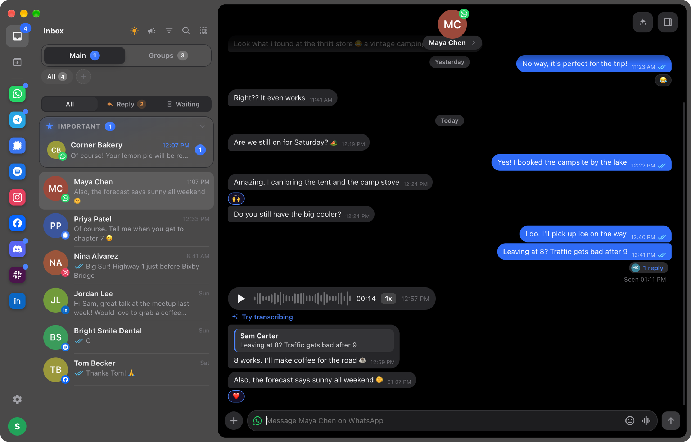

## Why Relay

- **One inbox for every network.** Each chat shows the logo of the network it comes from. Filter by network, keep groups in their own tab, and see what needs a reply first.
- **Nothing leaves your Mac.** Relay sets up its own small messaging server on your computer. There's no cloud, no Relay account, and your messages never pass through anyone else's servers. Each network sees Relay as a linked device, like WhatsApp Web.
- **Feels like the real apps.** Replies, reactions, edits, voice messages, read receipts, typing indicators, mentions, stickers, WhatsApp Status and Communities.
- **Make it yours.** Six styles, light and dark mode, accent colors and chat wallpapers.

## Make it yours

Pick a style, then mix it with light or dark mode, an accent color and a chat wallpaper.

<table>
  <tr>
    <td width="33%">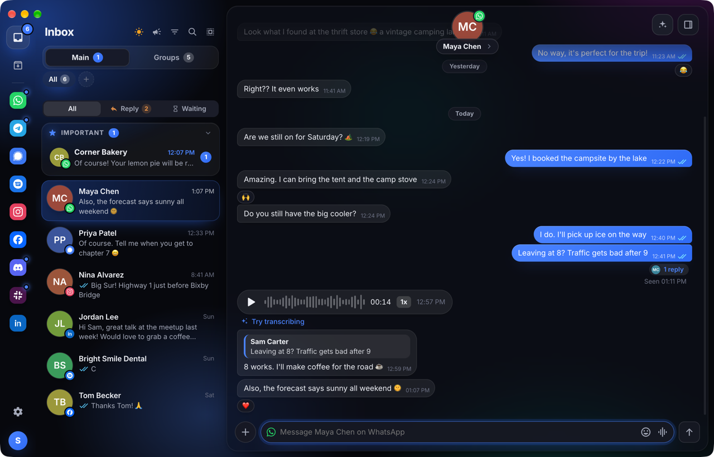</td>
    <td width="33%">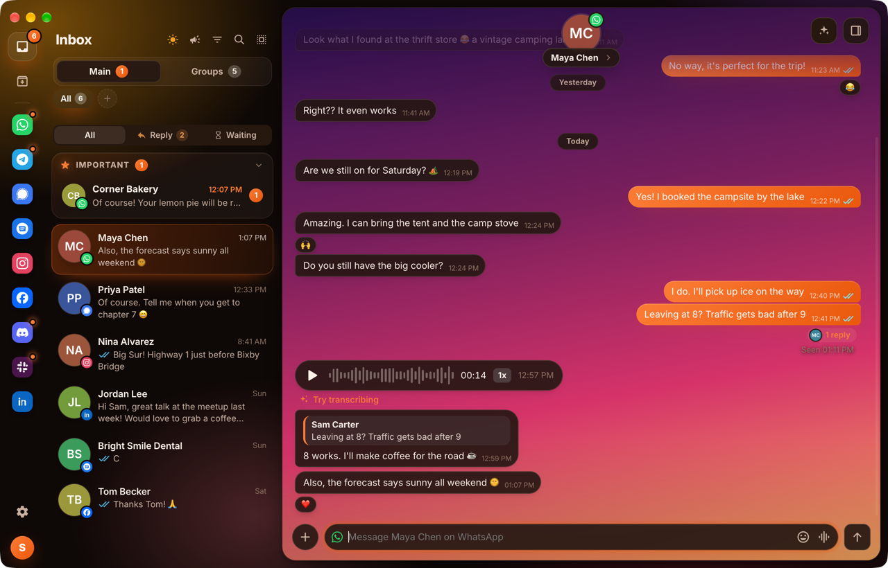</td>
    <td width="33%">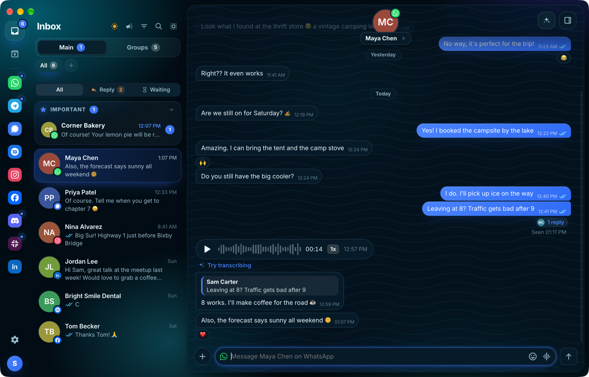</td>
  </tr>
  <tr>
    <td align="center"><b>Aurora</b></td>
    <td align="center"><b>Amber</b> · Sunset wallpaper</td>
    <td align="center"><b>Ocean</b> · Waves wallpaper</td>
  </tr>
  <tr>
    <td>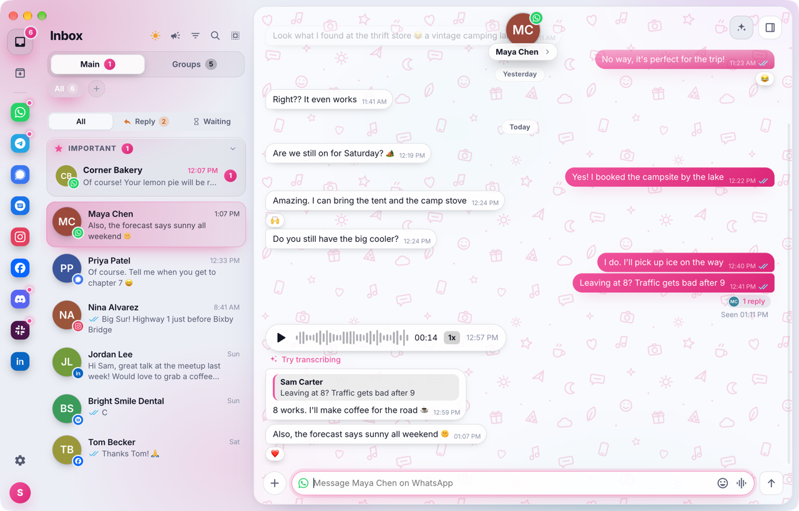</td>
    <td>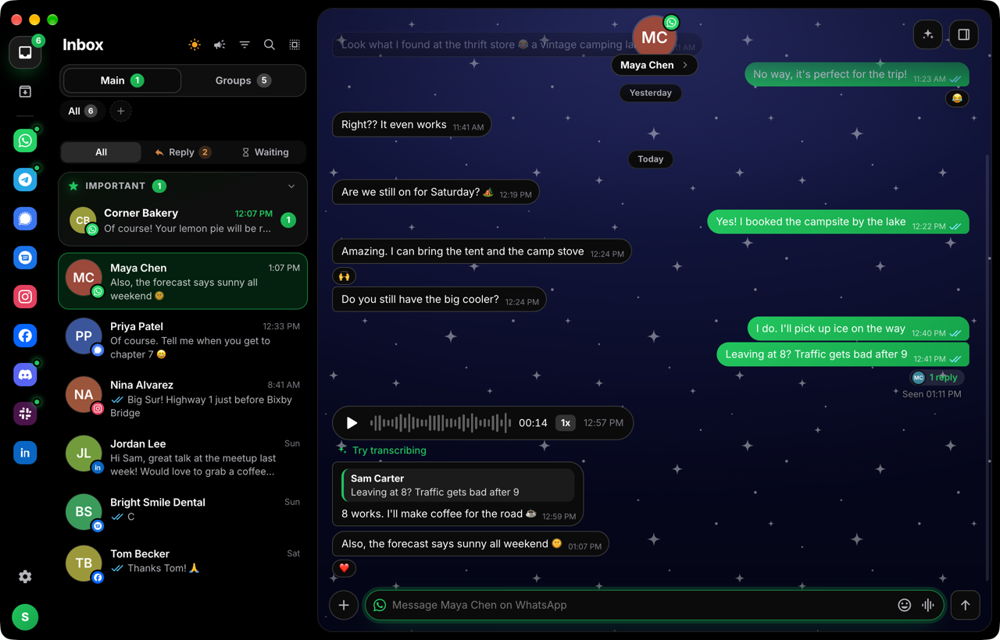</td>
    <td>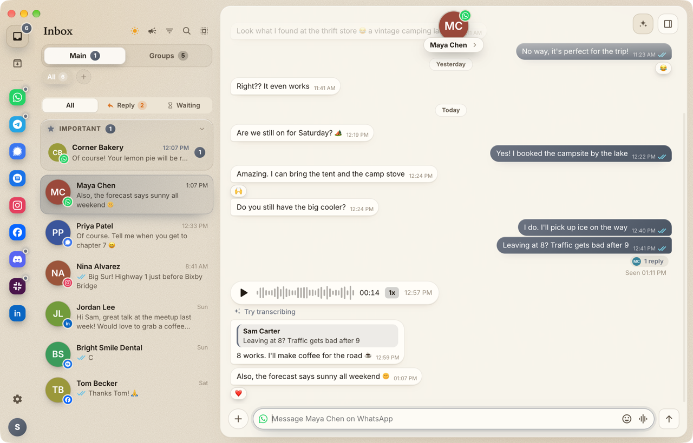</td>
  </tr>
  <tr>
    <td align="center"><b>Aurora light</b> · Doodles, pink</td>
    <td align="center"><b>OLED</b> · Night, green</td>
    <td align="center"><b>Paper</b> · graphite</td>
  </tr>
</table>

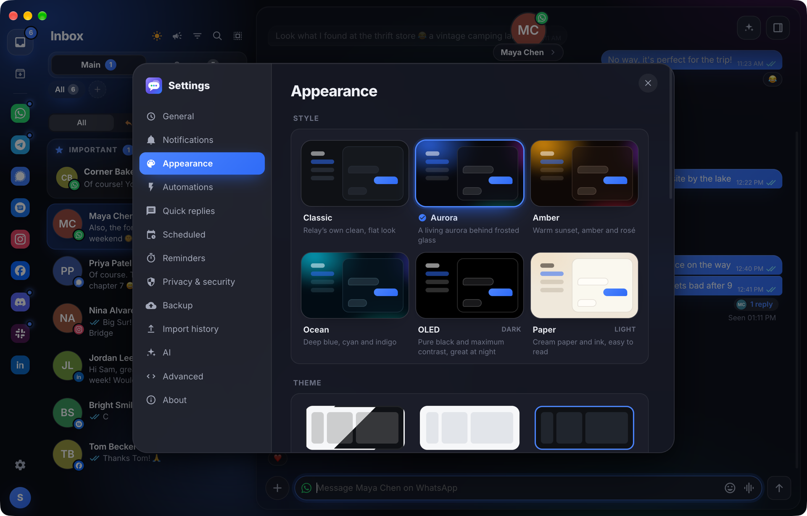

## Optional AI

Turn on AI and Relay can summarize, translate and plan your day. Run a model on your own Mac with [LM Studio](https://lmstudio.ai) and your messages still never leave it, or use the Claude, Codex, OpenCode or Gemini command-line apps if you already have them.

<table>
  <tr>
    <td width="50%">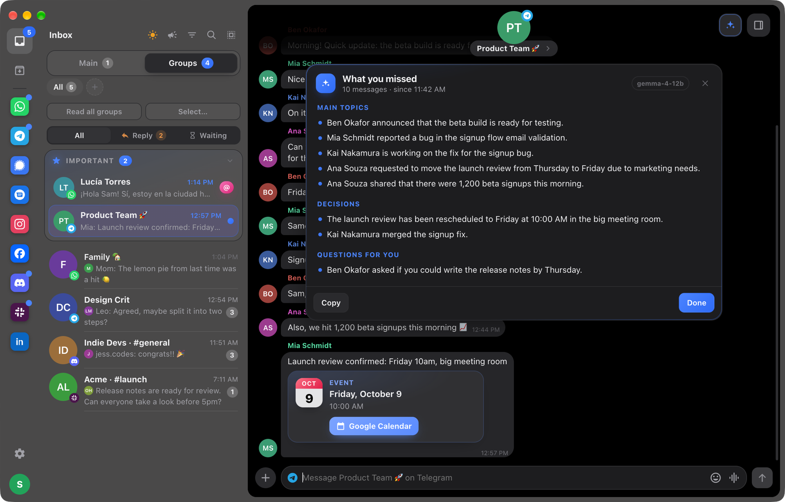</td>
    <td width="50%">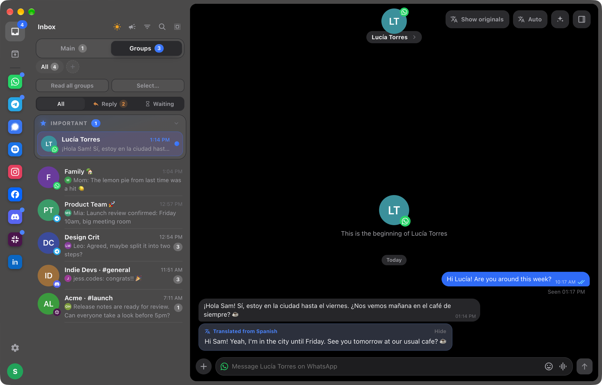</td>
  </tr>
  <tr>
    <td align="center"><b>What you missed:</b> a busy group in a few lines, with the decisions and the questions for you</td>
    <td align="center"><b>Translate</b> any message, or a whole chat automatically</td>
  </tr>
</table>

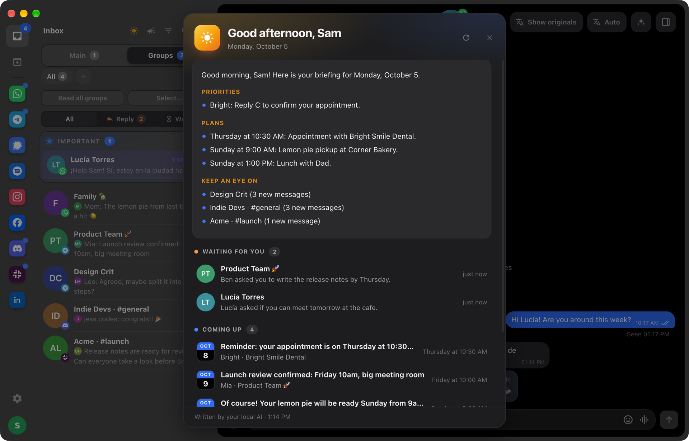

<b>Daily briefing:</b> what's waiting for your reply and what's coming up, in one place

## Built for speed

<table>
  <tr>
    <td width="50%">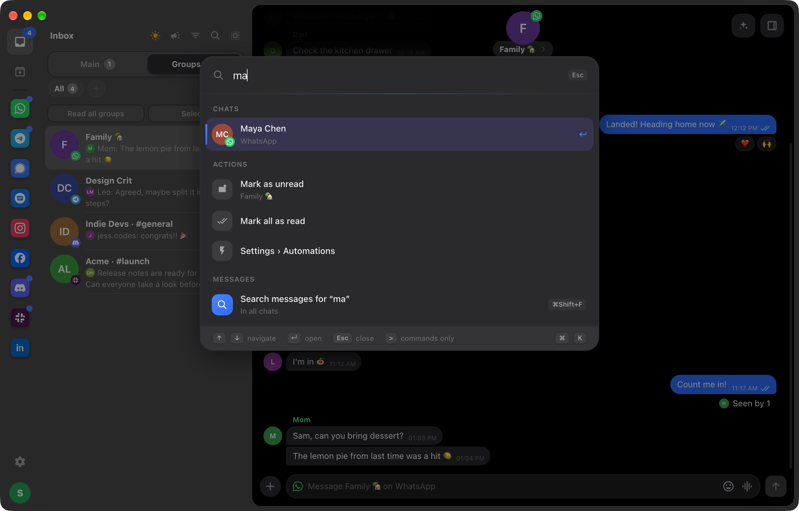</td>
    <td width="50%">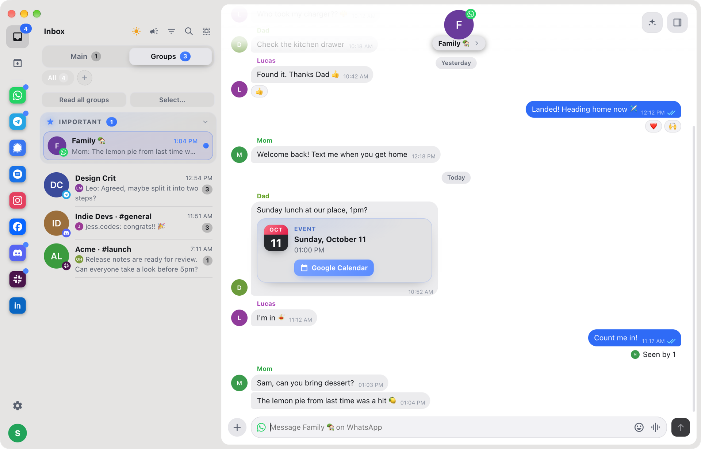</td>
  </tr>
  <tr>
    <td align="center">Press <kbd>⌘</kbd> <kbd>K</kbd> to jump to any chat, action or setting</td>
    <td align="center">Dates in messages become one-click calendar events</td>
  </tr>
</table>

## Features

- Unified inbox with Main and Groups tabs, an Important section, and Reply / Waiting filters
- Several accounts per network, for example a personal and a Business WhatsApp
- Chats you archive or pin on your phone are archived or pinned in Relay too
- Replies, threads, reactions, edits, deletes, forwarding and multi-select
- Photos, videos and files up to 2 GB, with a preview and caption before sending
- Voice messages with waveform and playback speed
- Read receipts, typing indicators and @mentions; on WhatsApp, read without sending blue ticks
- Scheduled messages, reminders, quick replies and automations
- Native notifications, Dock badge and sounds
- End-to-end encryption, with your session stored in the macOS Keychain
- In 8 languages: English, Portuguese, Spanish, French, German, Italian, Japanese and Chinese

## Install

1. Download the `.dmg` for your Mac from the [latest release](https://github.com/alenkpedro/relay/releases/latest): `arm64` for Apple silicon (M1 or newer), `x64` for Intel.
2. Open it and drag Relay to **Applications**.
3. If macOS won't open it the first time, go to **System Settings → Privacy & Security → Open Anyway**.

Relay keeps itself up to date after that. Nothing else needs to be installed.

**Good to know**

- Messages arrive while your Mac is on and Relay is running (the window can be closed). Turn on **Settings → Open Relay when I log in**.
- Telegram needs a free API key from my.telegram.org. Relay walks you through it.
- Connecting a personal Discord, Instagram, Messenger, X or LinkedIn account through an unofficial client can go against those services' terms. Bans are rare, but possible.

## About this repository

This repository holds the Relay installers. The app's source code is not public.

`whatsapp-sync-login.patch` is a modification of [mautrix-whatsapp](https://github.com/mautrix/whatsapp) that Relay applies when it builds the WhatsApp bridge on your Mac. It is distributed under the **AGPL-3.0**, the same license as mautrix-whatsapp. Each release also includes the version of the patch it uses.

Versions up to 0.5.0 were published under the MIT license.

Relay is an independent project, not affiliated with Meta, Telegram, Signal, Discord, Slack, LinkedIn or any other network it connects to. Network names and logos belong to their owners. The people and conversations in the screenshots are fictional.
